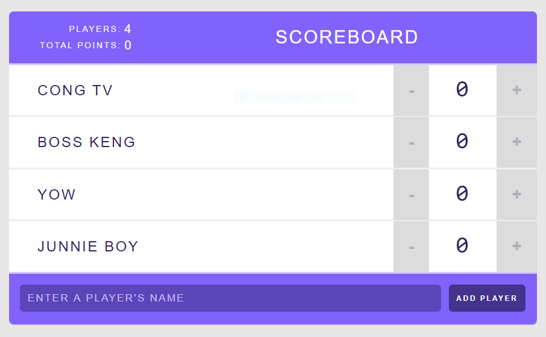

# Scoreboard React App

The scoreboard has 4 predefined players. Each player has their score counter. The user can increment and decrement the score by 1 point by clicking the "+" or "-" button. Players can also be removed by clicking the "x" button beside the player's name. The number of players and total points accumulated by the players will be updated on the header whenever a change occurs.

## Components:

### App

The App component contains the player objects and the props of Header, Player, and AddPlayerForm components. This component is in charge of handling the changes in states and rendering all of the components to the root container.

### Header

The Header component returns the title and sets the Stats component's props.

### Stats

The Stats component returns the number of players and the total points accumulated by the players.

### Player

The Player component returns the list of players with its corresponding score and allows the user to remove a player.

### Counter

The Counter component allows the user to change the state of the player's score by incrementing and decrementing it with an onClick event.

### AddPlayerForm

The AddPlayerForm component allows the user to add new players when the form is submitted.

